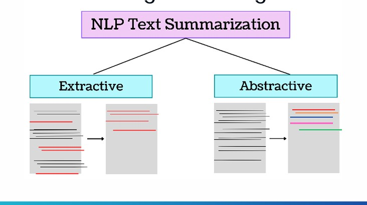

# International Competition of the Military Technical College  
**Artificial Intelligence Competition for Summarization Task**

## Overview  
This project is developed for the **Artificial Intelligence Competition** organized by the Military Technical College. The task involves **summarization**, where participants use advanced AI techniques to generate concise and meaningful summaries of given texts.

### Types of Summarization  

- **Extractive Summarization**: Selects key sentences or phrases directly from the original text and combines them into a summary.  
- **Abstractive Summarization**: Generates entirely new sentences that encapsulate the meaning of the original text.  

---

## Datasets  

### 1. **WikiLingua**  
- Approximately **770k article-summary pairs** in 18 languages sourced from WikiHow.  
- Contains around **29,229 article-summary pairs** with parallel English summaries.  

### 2. **XL-Sum**  
- Latest version includes **1.35 million article-summary pairs** in 44 languages.  
- Contains around **46,897 article-summary pairs** for training and evaluation.  

---

## Tools and Libraries  

This project leverages cutting-edge AI frameworks and libraries:  
- **PyTorch**: For deep learning and model development.  
- **Transformers**: Pre-trained language models and summarization tools.  
- **Tokenizers**: Efficient tokenization for large datasets.  
- **SentencePiece**: Subword units for language modeling.  
- **Fairseq**: A sequence-to-sequence learning toolkit by Facebook AI.  

---

## Evaluation Metrics  

The quality of summarization is assessed using **ROUGE** metrics:  
- **ROUGE-1**: Measures overlap of unigrams between the summary and the reference.  
- **ROUGE-2**: Measures overlap of bigrams.  
- **ROUGE-L**: Considers the longest common subsequence (LCS) between the summary and the reference.  
